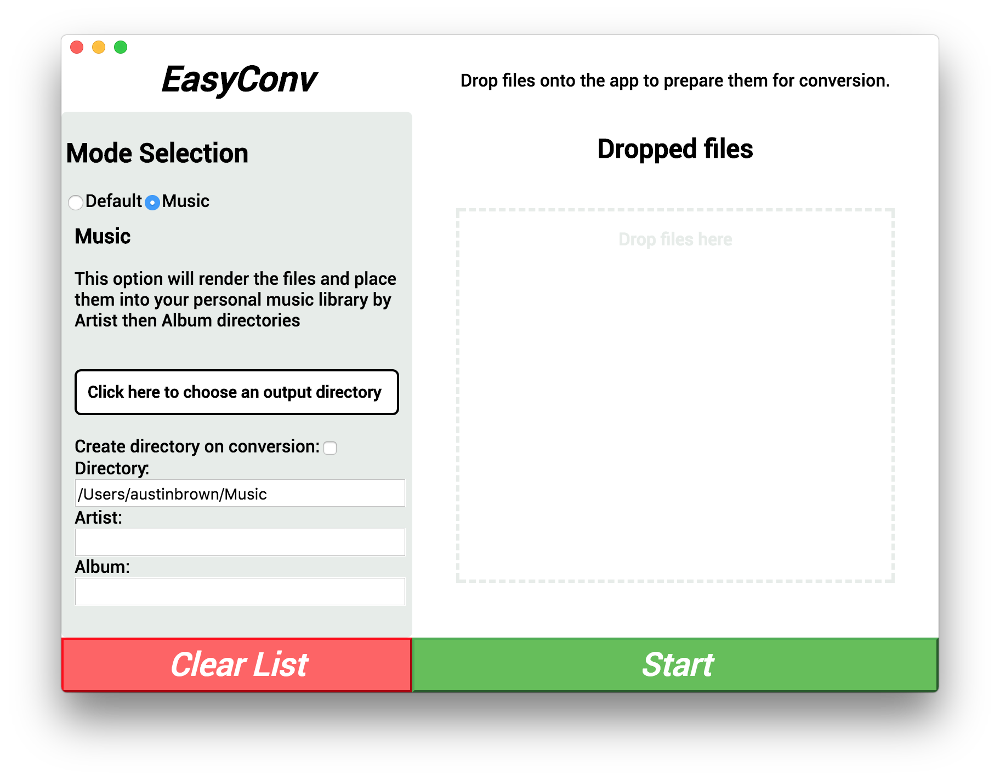

EasyConv
========

Drag and drop conversion app built using Electron and React.

In the project directory, run

`npm start`

There are two modes for conversion. 

## Default

The Default mode will place the files directly in the folder you specify. 

## Music
The Music mode will ask for the directory that you store music in. By providing the artist name and the album title, EasyConv will create folders (music/artist/album) if they do not exist and place the files there for storage. This is based on the assumption that you organize your music by Artist/Album.

**NOTE**: There are vunerability issues with the npm module foreman that should not be an issue as this is used purely locally.